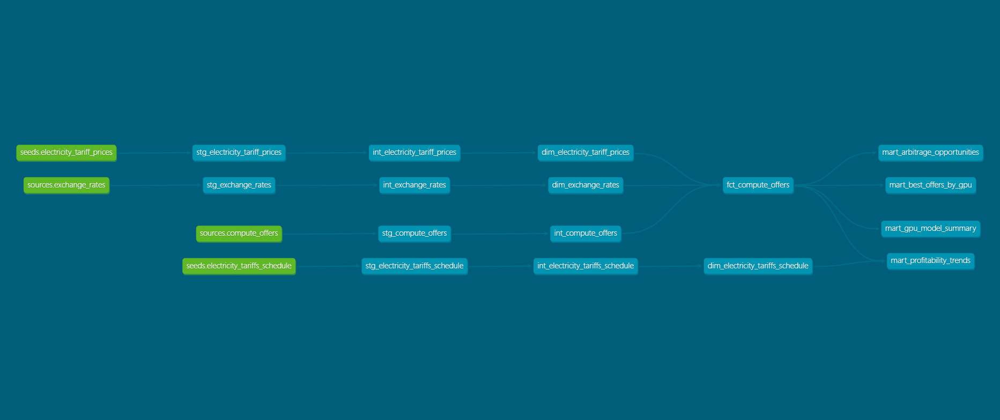

# GPU Compute Arbitrage Monitor

> **Is it profitable to rent a GPU on Vast.AI given local electricity prices?**

A full end-to-end data pipeline that ingests GPU compute market data, local electricity tariff data, and live exchange
rates — then models them into analytical outputs that answer arbitrage questions in real time.

---

## What Questions Does It Answer?

| Question                                                                       | Where to look                  |
|--------------------------------------------------------------------------------|--------------------------------|
| Which GPU offers on Vast.AI are profitable right now, after electricity costs? | `mart_arbitrage_opportunities` |
| Which GPU model gives the best profit per TFLOP at the current tariff?         | `mart_best_offers_by_gpu`      |
| Which GPU models have been consistently profitable historically?               | `mart_gpu_model_summary`       |
| Does profitability change by time of day (high vs low tariff hours)?           | `mart_profitability_trends`    |

The core calculation: `profit = GPU rental revenue − electricity cost`, where electricity cost is derived from **GPU
TDP × number of GPUs × applicable Macedonian tariff rate**, converted to USD at the current exchange rate.

---

## Architecture


**Data flow per source DAG:**
`ingest → zip_src → [upload_src, upload_config, upload_entrypoint] → refine (Dataproc) → register_external_tables → dbt run → dbt test → publish Asset`

The marts DAG fires automatically (`AssetAny`) when any upstream source completes successfully.

---

## Tech Stack

| Layer              | Technology                                             |
|--------------------|--------------------------------------------------------|
| Ingestion          | Python 3.12, aiohttp, requests, BeautifulSoup, PyArrow |
| Processing         | PySpark 4.1 on GCP Dataproc                            |
| Storage            | GCS, BigQuery                                          |
| Transformation     | dbt-bigquery 1.11+                                     |
| Orchestration      | Apache Airflow 3 (Docker Compose, LocalExecutor)       |
| Infrastructure     | Terraform, GCP (Dataproc, GCS, BigQuery)               |
| Package management | uv (Astral)                                            |
| Config/Validation  | Pydantic v2                                            |

---

## Quick Start

### Prerequisites

- Python 3.12+
- [uv](https://docs.astral.sh/uv/) installed
- Docker + Docker Compose
- A GCP project with BigQuery, GCS, and Dataproc APIs enabled
- `gcloud` CLI authenticated (`gcloud auth application-default login`)
- VastAI API key
- ExchangeRate API key
- Airflow keys

### 1. Clone and install

```bash
git clone <repo-url>
cd ai-compute-arbitrage-monitor
uv sync
```


### 2. Configure environment

```bash
cp .env.example .env
# Fill in: VASTAI_API_KEY, EXCHANGE_RATE_API_KEY,
#          POSTGRES_USER, POSTGRES_PASSWORD, POSTGRES_DB,
#          AIRFLOW_USER, AIRFLOW_PASSWORD, AIRFLOW_EMAIL,
#          AIRFLOW_FERNET_KEY, AIRFLOW_SECRET_KEY, AIRFLOW_JWT_SECRET,
#          GCP_APPLICATION_CREDENTIALS_PATH, GCP_PROJECT_ID
```

### 3. Generate Keys and Secrets

#### Vast.ai API Access Guide

To obtain and use a Vast.ai API key, you must access your account settings on the console. This key is essential for
authenticating requests made via
the [Vast.ai CLI](https://vast.ai/docs/cli/quickstart), [Python SDK](https://github.com/Vast-ai/vast-python), or
direct [REST API calls](https://vast.ai/docs/api-reference/intro).

##### How to Get Your API Key

1. **Log In**: Sign in to your account at the [Vast.ai Console](https://console.vast.ai/).
2. **Navigate to Keys**: Go to the [Keys](https://cloud.vast.ai/manage-keys/) section where all keys are managed. Select
   API Keys
3. **Generate a Key**: Click the **+New** button to create a new API key. You can assign a name and specific
   permissions (e.g., read-only or full access) during this step.
4. **Copy the Key**: Your key is a long hexadecimal string. Treat it like a password and do not share it.
5. **Assign**: Paste the value in the environment variable `VASTAI_API_KEY`

#### Quick Links & Documentation

* [Official Vast.ai Documentation](https://vast.ai/docs/)
* [API Reference](https://vast.ai/docs/api-reference/intro)
* [Vast.ai CLI GitHub Repository](https://github.com/Vast-ai/vast-python)
* [Pricing and Search Console](https://console.vast.ai/create/)

#### ExchangeRate API Access Guide

To integrate live currency data into your pipeline, you need to authenticate your requests using an API key from your
dashboard.

##### How to Get Your API Key

1. **Sign Up / Log In**: Access your account at
   the [ExchangeRate-API Dashboard](https://app.exchangerate-api.com/sign-in).
2. **View Dashboard**: Once logged in, your **API Key** is displayed prominently on the main landing page.
3. **Copy the Key**: Use this unique alphanumeric string for your authentication.
4. **Assign**: Paste the value in the environment variable `EXCHANGE_RATE_API_KEY`

##### Documentation & Resources

* [Official Documentation Home](https://www.exchangerate-api.com/docs/overview)
* [Standard Request Usage](https://www.exchangerate-api.com/docs/standard-requests)
* [Supported Currencies List](https://www.exchangerate-api.com/docs/supported-currencies)
* [Error Code Reference](https://www.exchangerate-api.com/docs/error-responses)

#### Security Keys and Secrets

`AIRFLOW_FERNET_KEY`: Airflow uses a Fernet key to encrypt connection passwords and variables.

```python
from cryptography.fernet import Fernet

print(Fernet.generate_key().decode())
```

`AIRFLOW_SECRET_KEY`:
Airflow uses 16-bit hexadecimal key for session signing

```python 
import secrets

print(secrets.token_hex(16))
```

`AIRFLOW_JWT_SECRET`:
Airflow uses 32-bit hexadecimal key for signing JWT tokens for API access

```python 
import secrets

print(secrets.token_hex(32))
```

#### Google Cloud credentials

```bash
gcloud auth application-default login
```
1. Create a new project and paste the project id in the `GCP_PROJECT_ID` environment variable
2. Update the `GCP_APPLICATION_CREDENTIALS_PATH` environment variable with the path to your Google Cloud credentials.

##### Documentation and Resources
[How Application Default Credentials Work](https://docs.cloud.google.com/docs/authentication/application-default-credentials)

### 4. Provision GCP infrastructure

```bash
cd infra/terraform
cp terraform.tfvars.example terraform.tfvars
# Edit terraform.tfvars with your project_id, region, bucket_name, cluster_name
terraform init
terraform apply
# Wait ~5 minutes for infra to complete
```

### 5. Configure dbt

```bash
cd src/transform
# Fill in project-id, dataset, location 
dbt debug # make sure connection works
dbt deps # install dependencies
```

### 6. Start Airflow

```bash
cd infra/airflow
docker compose --env-file ../../.env up --build -d
# Wait ~60 seconds for init to complete
# Open http://localhost:8080
```

### 7. Run pipelines

In the Airflow UI, trigger each source DAG manually for the first run (they must all complete at least once before the
marts DAG can run):

1. `gpu_arbitrage__compute_offers`
2. `gpu_arbitrage__exchange_rates`
3. `gpu_arbitrage__electricity_tariff_prices`
4. `gpu_arbitrage__electricity_tariffs_schedule`

After all four complete, `gpu_arbitrage__marts` will trigger automatically.


# Dashboard
**URL:** https://datastudio.google.com/s/le_oE8-VaPM

---

## Charts

### 1. GPU Profitability Rate by Offer Type

| Field        | Detail                                                              |
| :----------- | :------------------------------------------------------------------ |
| **Chart type**   | Bar chart                                                       |
| **Name**         | GPU model summary bar                                           |
| **Mart source**  | `mart_gpu_model_summary`                                        |
| **What it shows**| Profitability rate broken down by GPU model and offer type      |

---

### 2. Current Best Profit per GPU

| Field        | Detail                                                              |
| :----------- | :------------------------------------------------------------------ |
| **Chart type**   | Bar chart                                                       |
| **Name**         | Best offers bar                                                 |
| **Mart source**  | `mart_best_offers_by_gpu`                                       |
| **What it shows**| The single best profit opportunity per GPU model at the current moment |

---

### 3. Profit Over Time by GPU

| Field        | Detail                                                              |
| :----------- | :------------------------------------------------------------------ |
| **Chart type**   | Time series                                                     |
| **Name**         | Trends time series                                              |
| **Mart source**  | `mart_profitability_trends`                                     |
| **What it shows**| Profitability trends over time, segmented by GPU                |

---

### 4. Profit by Day and Hour

| Field        | Detail                                                              |
| :----------- | :------------------------------------------------------------------ |
| **Chart type**   | Pivot table / heatmap                                           |
| **Name**         | Trends pivot/heatmap                                            |
| **Mart source**  | `mart_profitability_trends`                                     |
| **What it shows**| Heatmap of profitability across days of week and hours of day   |

---

### 5. Risk vs Reward — Live Offers

| Field        | Detail                                                              |
| :----------- | :------------------------------------------------------------------ |
| **Chart type**   | Scatter plot                                                    |
| **Name**         | Arbitrage scatter                                               |
| **Mart source**  | `mart_arbitrage_opportunities`                                  |
| **What it shows**| Live offers plotted by risk vs. reward to surface best arbitrage bets |

---

### 6. Profit per TFLOP — Live Offers

| Field        | Detail                                                              |
| :----------- | :------------------------------------------------------------------ |
| **Chart type**   | Bar chart                                                       |
| **Name**         | Arbitrage bar                                                   |
| **Mart source**  | `mart_arbitrage_opportunities`                                  |
| **What it shows**| Compute-normalized profitability ($/TFLOP) across live offers   |

---

### 7. Available Offers Scorecard

| Field        | Detail                                                              |
| :----------- | :------------------------------------------------------------------ |
| **Chart type**   | Scorecard (KPI tile)                                            |
| **Name**         | Scorecard                                                       |
| **Mart source**  | `mart_arbitrage_opportunities`                                  |
| **What it shows**| Count of live offers available right now                        |

---

## Mart Sources Summary

| Mart                         | Used by charts                                      |
| :--------------------------- | :-------------------------------------------------- |
| `mart_gpu_model_summary`     | GPU Profitability Rate by Offer Type                |
| `mart_best_offers_by_gpu`    | Current Best Profit per GPU                         |
| `mart_profitability_trends`  | Profit Over Time by GPU, Profit by Day and Hour     |
| `mart_arbitrage_opportunities` | Risk vs Reward, Profit per TFLOP, Scorecard       |

## Data Lineage & Model Docs

Full model documentation — descriptions, column definitions, and lineage graph — is available via dbt docs:

```bash
cd src/transform
dbt docs generate
dbt docs serve
# Open http://localhost:8080

```


## Project Structure

```
gpu-arbitrage-monitor/
│
├── src/
│   ├── config/                     # Pydantic config models + YAML loader
│   │   ├── loader.py               # ConfigLoader, BronzeConfigLoader, SilverConfigLoader
│   │   ├── file_config.py          # FileConfig base (path helpers)
│   │   ├── storage.py              # GCPStorageConfig, LocalStorageConfig
│   │   ├── cluster.py              # GCPClusterConfig
│   │   ├── http.py                 # HttpConfig
│   │   ├── seeds/                  # ERCConfig, EVNConfig
│   │   └── sources/                # VastAIConfig, ExchangeRateConfig
│   │
│   ├── ingest/                     # Bronze layer
│   │   ├── base.py                 # BatchIngestor, SyncBatchIngestor, AsyncBatchIngestor
│   │   ├── models/                 # Pydantic models (VastAIOffer, ExchangeRate, etc.)
│   │   │   ├── base.py             # BaseRecord (ingested_at)
│   │   │   ├── enums.py            # All enums
│   │   │   ├── types.py            # DatasetConfig, IngestorRecord type aliases
│   │   │   ├── vast_ai_offer.py
│   │   │   ├── exchange_rate.py
│   │   │   ├── electricity_tariff_price.py
│   │   │   └── electricity_tariff_schedule.py
│   │   ├── sources/
│   │   │   ├── vast_ai.py          # VastAISource
│   │   │   └── exchange_rate.py    # ExchangeRateSource
│   │   └── seeds/
│   │       ├── electricity_tariff_price.py    # ElectricityTariffPricesSeed
│   │       └── electricity_tariff_schedule.py # ElectricityTariffScheduleSeed
│   │
│   ├── refine/                     # Silver layer (PySpark)
│   │   ├── schemas.py              # PySpark StructType schemas
│   │   ├── assets/
│   │   │   ├── base.py             # Pipeline dataclass
│   │   │   ├── cleaning.py
│   │   │   ├── filtering.py
│   │   │   ├── casting.py
│   │   │   └── extract.py
│   │   └── pipelines/
│   │       ├── compute_offers.py
│   │       ├── exchange_rates.py
│   │       ├── electricity_tariff_prices.py
│   │       └── electricity_tariffs_schedule.py
│   │
│   └── transform/                  # Gold layer (dbt)
│       ├── dbt_project.yml
│       ├── profiles.yml
│       ├── sources.yaml
│       ├── macros/                 # cast_utc, round_gpu_mb, translate_tariff_description, etc.
│       └── models/
│           ├── staging/            # stg_compute_offers, stg_exchange_rates, ...
│           ├── intermediate/       # int_compute_offers, int_exchange_rates, ...
│           ├── warehouse/          # fct_compute_offers, dim_exchange_rates, ...
│           └── marts/              # mart_arbitrage_opportunities, mart_best_offers_by_gpu, ...
│
├── infra/
│   ├── airflow/
│   │   ├── Dockerfile
│   │   ├── docker-compose.yml
│   │   └── dags/
│   │       ├── dag.py              # DAG registration
│   │       ├── dag_factory.py      # DagFactory (per-source DAG builder)
│   │       ├── marts_dag_factory.py
│   │       └── data_source_config.py  # PipelineConfig dataclass
│   └── terraform/
│       ├── main.tf
│       ├── variables.tf
│       └── terraform.tfvars.example
│
├── settings.yaml                   # Pipeline config (paths, URLs, selectors)
├── pyproject.toml                  # Python dependencies (uv)
├── .env.example                    # Environment variable template
└── docs/
    ├── technical_documentation.docx
    ├── user_guide.md
    └── design_choices.md
```

---

## Known Limitations

**Infrastructure**

- The Dataproc cluster must be running before any Silver pipeline can execute. There is no auto-start logic — the
  cluster must be started manually or pre-provisioned.
- The local Docker Compose setup cannot fully replicate the GCP environment. The `refine` step in each DAG submits a
  PySpark job to a live Dataproc cluster and will fail without one.

- **Data quality**
- Electricity cost calculations assume GPU TDP (thermal design power) as a proxy for actual power draw. Real consumption
  varies by workload — TDP is the worst case.
- The tariff schedule is hardcoded based on the 2026 regulatory decision. If EVN updates their schedule and the page
  text changes, the seed will stop emitting data until manually reviewed and updated.
- `geolocation` from Vast.AI is a free-text string (e.g. "Texas, US", "Frankfurt, DE"). Country code extraction splits
  on comma and takes the last element — malformed or unexpected formats will produce NULL country codes.
- Vast.AI offer data reflects availability at the time of the hourly poll. Offers can appear and disappear between
  polls; the pipeline does not capture sub-hourly changes.

**Exchange rates**

- The pipeline tracks a single currency pair (USD → MKD). Multi-currency support would require config changes across the
  ingestor, Silver schema, and all Gold cost calculations.

**Scale**

- At 10,000 offers per type × 3 types × ~24 polls/day, `fct_compute_offers` grows by ~720,000 rows/day. BigQuery handles
  this comfortably, but downstream tools connecting directly to the fact table (rather than the marts) should always
  apply date range filters.
