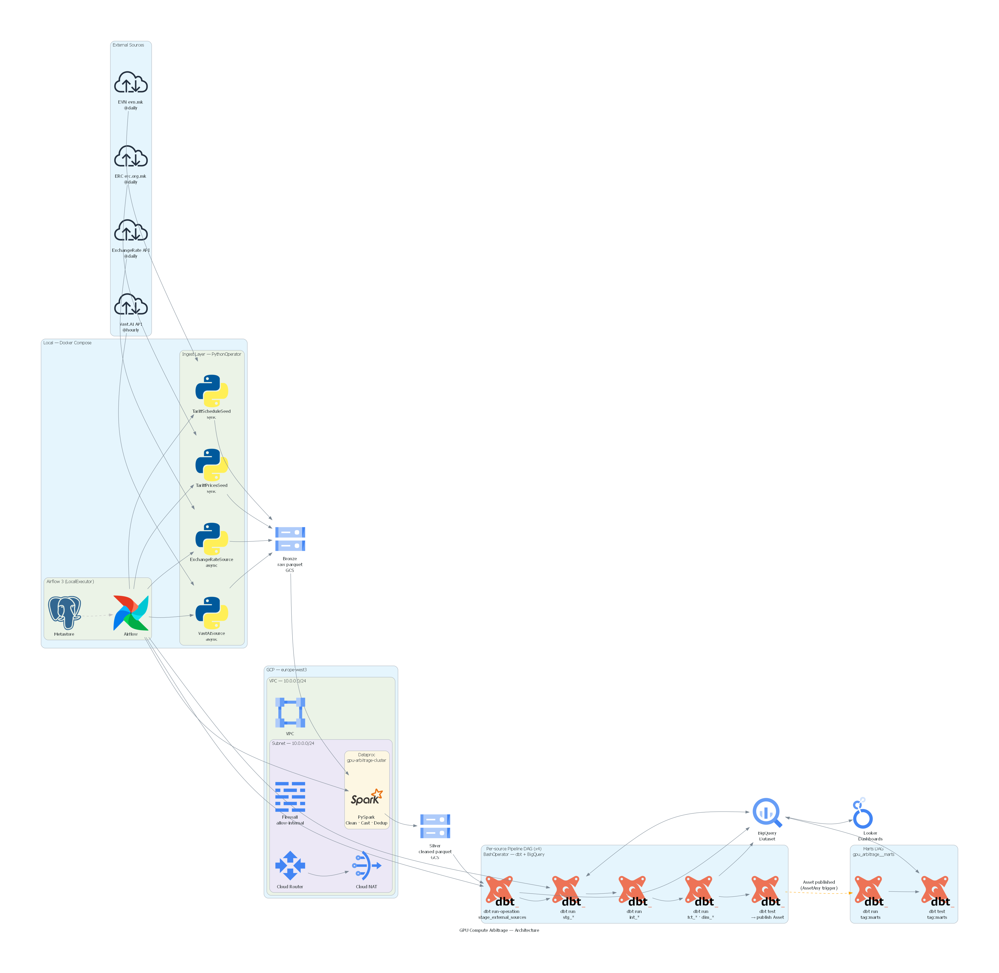

# GPU Compute Arbitrage Monitor

> **Is it profitable to rent a GPU on Vast.AI given local electricity prices?**

A full end-to-end data pipeline that ingests GPU compute market data, local electricity tariff data, and live exchange rates — then models them into analytical outputs that answer arbitrage questions in real time.

---

## What Questions Does It Answer?

| Question | Where to look |
|---|---|
| Which GPU offers on Vast.AI are profitable right now, after electricity costs? | `mart_arbitrage_opportunities` |
| Which GPU model gives the best profit per TFLOP at the current tariff? | `mart_best_offers_by_gpu` |
| Which GPU models have been consistently profitable historically? | `mart_gpu_model_summary` |
| Does profitability change by time of day (high vs low tariff hours)? | `mart_profitability_trends` |

The core calculation: `profit = GPU rental revenue − electricity cost`, where electricity cost is derived from **GPU TDP × number of GPUs × applicable Macedonian tariff rate**, converted to USD at the current exchange rate.

---

## Architecture



**Data flow per source DAG:**
`ingest → zip_src → [upload_src, upload_config, upload_entrypoint] → refine (Dataproc) → register_external_tables → dbt run → dbt test → publish Asset`

The marts DAG fires automatically (`AssetAny`) when any upstream source completes successfully.

---

## Tech Stack

| Layer | Technology                                             |
|---|--------------------------------------------------------|
| Ingestion | Python 3.12, aiohttp, requests, BeautifulSoup, PyArrow |
| Processing | PySpark 4.1 on GCP Dataproc                            |
| Storage | GCS, BigQuery                                          |
| Transformation | dbt-bigquery 1.11+                                     |
| Orchestration | Apache Airflow 3 (Docker Compose, LocalExecutor)       |
| Infrastructure | Terraform, GCP (Dataproc, GCS, BigQuery)               |
| Package management | uv (Astral)                                            |
| Config/Validation | Pydantic v2                                            |

---

## Quick Start

### Prerequisites

- Python 3.12+
- [uv](https://docs.astral.sh/uv/) installed
- Docker + Docker Compose
- A GCP project with BigQuery, GCS, and Dataproc APIs enabled
- `gcloud` CLI authenticated (`gcloud auth application-default login`)
- VastAI API key
- ExchangeRate API key

### 1. Clone and install

```bash
git clone <repo-url>
cd gpu-arbitrage-monitor
uv sync
```

### 2. Generate API Keys


#### Vast.ai API Access Guide

To obtain and use a Vast.ai API key, you must access your account settings on the console. This key is essential for authenticating requests made via the [Vast.ai CLI](https://vast.ai/docs/cli/quickstart), [Python SDK](https://github.com/Vast-ai/vast-python), or direct [REST API calls](https://vast.ai/docs/api-reference/intro).

#### How to Get Your API Key

1.  **Log In**: Sign in to your account at the [Vast.ai Console](https://console.vast.ai/).
2.  **Navigate to Keys**: Go to the [Account Settings](https://console.vast.ai/account/) section where the API keys are managed.
3.  **Generate a Key**: Click the **+New** button to create a new API key. You can assign a name and specific permissions (e.g., read-only or full access) during this step.
4.  **Copy the Key**: Your key is a long hexadecimal string. Treat it like a password and do not share it.

#### Quick Links & Documentation

* [Official Vast.ai Documentation](https://vast.ai/docs/)
* [API Reference](https://vast.ai/docs/api-reference/intro)
* [Vast.ai CLI GitHub Repository](https://github.com/Vast-ai/vast-python)
* [Pricing and Search Console](https://console.vast.ai/create/)

#### ExchangeRate API Acess Guide


To integrate live currency data into your pipeline, you need to authenticate your requests using an API key from your dashboard.

#### How to Get Your API Key

1. **Sign Up / Log In**: Access your account at the [ExchangeRate-API Dashboard](https://app.exchangerate-api.com/sign-in).
2. **View Dashboard**: Once logged in, your **API Key** is displayed prominently on the main landing page.
3. **Copy the Key**: Use this unique alphanumeric string for your authentication.

#### API Request Structure

ExchangeRate-API uses a URL-based authentication format. Your standard endpoint will look like this:

`https://v6.exchangerate-api.com/v6/YOUR-API-KEY/latest/USD`

#### Documentation & Resources

* [Official Documentation Home](https://www.exchangerate-api.com/docs/overview)
* [Standard Request Usage](https://www.exchangerate-api.com/docs/standard-requests)
* [Supported Currencies List](https://www.exchangerate-api.com/docs/supported-currencies)
* [Error Code Reference](https://www.exchangerate-api.com/docs/error-responses)


### 3. Configure environment

```bash
cp .env.example .env
# Fill in: VASTAI_API_KEY, EXCHANGE_RATE_API_KEY, GCP_PROJECT_ID,
#          POSTGRES_USER, POSTGRES_PASSWORD, POSTGRES_DB,
#          AIRFLOW_USER, AIRFLOW_PASSWORD, AIRFLOW_EMAIL,
#          AIRFLOW_FERNET_KEY, AIRFLOW_SECRET_KEY, AIRFLOW_JWT_SECRET
```
### 4. Configure dbt
```bash
cd src/transform
cp profiles.yml.example profiles.yml
# Fill in project, dataset, location
dbt debug # make sure connection works
dbt deps # install dependencies
```

### 5. Provision GCP infrastructure

```bash
cd ../../
cd infra/terraform
cp terraform.tfvars.example terraform.tfvars
# Edit terraform.tfvars with your project_id, region, bucket_name, cluster_name
terraform init
terraform apply
# Wait ~5 minutes for infra to complete
```

### 6. Start Airflow

```bash
cd infra/airflow
docker compose up --build -d
# Wait ~60 seconds for init to complete
# Open http://localhost:8080
```

### 7. Run pipelines

In the Airflow UI, trigger each source DAG manually for the first run (they must all complete at least once before the marts DAG can run):

1. `gpu_arbitrage__compute_offers`
2. `gpu_arbitrage__exchange_rates`
3. `gpu_arbitrage__electricity_tariff_prices`
4. `gpu_arbitrage__electricity_tariffs_schedule`

After all four complete, `gpu_arbitrage__marts` will trigger automatically.

---


## Dashboard

URL: https://datastudio.google.com/s/le_oE8-VaPM

| Chart | Name | Mart Source |
| :--- | :--- | :--- |
| **GPU model summary bar** | GPU profitability rate by offer type | `mart_gpu_model_summary` |
| **Best offers bar** | Current best profit per GPU | `mart_best_offers_by_gpu` |
| **Trends time series** | Profit over time by GPU | `mart_profitability_trends` |
| **Trends pivot/heatmap** | Profit by day and hour | `mart_profitability_trends` |
| **Arbitrage scatter** | Risk vs reward — live offers | `mart_arbitrage_opportunities` |
| **Arbitrage bar** | Profit per TFLOP — live offers | `mart_arbitrage_opportunities` |
| **Scorecard** | Available offers right now | `mart_arbitrage_opportunities` |
---

## Data Model Diagram

```
                    ┌──────────────────────┐
                    │   dim_exchange_rates │
                    │  ─────────────────── │
                    │  skey (PK)           │
                    │  from_currency       │
                    │  to_currency         │
                    │  value               │
                    │  inverse_value       │
                    │  valid_from          │
                    │  valid_to            │
                    │  is_latest           │
                    └──────────┬───────────┘
                               │ point-in-time join
┌──────────────────────┐       │       ┌──────────────────────────┐
│dim_electricity_tariff│       │       │ dim_electricity_tariffs  │
│      _prices         │       │       │       _schedule          │
│ ──────────────────── │       │       │ ──────────────────────── │
│ skey (PK)            │       │       │ skey (PK)                │
│ tariff_type          │       │       │ day_of_week              │
│ tariff_description_en│       │       │ hour                     │
│ tariff_description_mk│       │       │ tariff_type              │
│ price_mkd_per_kwh    │       │       │ valid_from / valid_to    │
│ valid_from / valid_to│       │       │ is_latest                │
│ is_latest            │       │       └────────────┬─────────────┘
└──────────┬───────────┘       │                    │ time-of-day join
           │ point-in-time join│                    │
           └───────────────────┼────────────────────┘
                               │
                    ┌──────────▼───────────┐
                    │  fct_compute_offers  │
                    │  ─────────────────── │
                    │  offer_id            │
                    │  machine_id / host_id│
                    │  offer_type          │
                    │  valid_from / valid_to│
                    │  gpu_* (specs)       │
                    │  cpu_* (specs)       │
                    │  ram_gb / disk_*     │
                    │  revenue_usd_per_hr  │
                    │  total_system_kwh_..│
                    │  cost_* (7 variants) │
                    │  profit_* (7 variants│
                    │  profit_per_tflop_* │
                    │  exchange_rate_skey  │
                    └──────────┬───────────┘
                               │
            ┌──────────────────┼──────────────────────┐
            │                  │                       │
            ▼                  ▼                       ▼
┌─────────────────┐ ┌─────────────────────┐ ┌──────────────────────┐
│ mart_arbitrage  │ │mart_best_offers     │ │mart_profitability    │
│  _opportunities │ │    _by_gpu          │ │      _trends         │
│ ─────────────── │ │ ─────────────────── │ │ ──────────────────── │
│ arbitrage_rank  │ │ offer_type          │ │ hour_bucket          │
│ offer_type      │ │ gpu_model_name      │ │ day_of_week          │
│ gpu specs       │ │ gpu_memory_gb       │ │ tariff_window        │
│ profit_*        │ │ per-GPU cost/profit │ │ avg/min/max profit_* │
│ All tariff      │ │ profit_per_tflop_* │ │ All tariff variants  │
│   variants      │ └─────────────────────┘ └──────────────────────┘
└─────────────────┘

                    ┌──────────────────────┐
                    │ mart_gpu_model       │
                    │     _summary         │
                    │ ─────────────────────│
                    │ gpu_model_name       │
                    │ offer_type           │
                    │ total_observations   │
                    │ pct_profitable_* (7) │
                    │ avg_reliability_score│
                    └──────────────────────┘
```

**The 7 tariff scenarios** computed across all cost/profit/TFLOP columns:

| Scenario key | Description |
|---|---|
| `household_1_high` | Household tier 1, high tariff (ВТ1) |
| `household_2_high` | Household tier 2, high tariff (ВТ2) |
| `household_3_high` | Household tier 3, high tariff (ВТ3) |
| `household_4_high` | Household tier 4, high tariff (ВТ4) |
| `household_low` | Household low tariff (НТ) |
| `business_high` | Small business high tariff (ВТ) |
| `business_low` | Small business low tariff (НТ) |

---

## Project Structure

```
gpu-arbitrage-monitor/
│
├── src/
│   ├── config/                     # Pydantic config models + YAML loader
│   │   ├── loader.py               # ConfigLoader, BronzeConfigLoader, SilverConfigLoader
│   │   ├── file_config.py          # FileConfig base (path helpers)
│   │   ├── storage.py              # GCPStorageConfig, LocalStorageConfig
│   │   ├── cluster.py              # GCPClusterConfig
│   │   ├── http.py                 # HttpConfig
│   │   ├── seeds/                  # ERCConfig, EVNConfig
│   │   └── sources/                # VastAIConfig, ExchangeRateConfig
│   │
│   ├── ingest/                     # Bronze layer
│   │   ├── base.py                 # BatchIngestor, SyncBatchIngestor, AsyncBatchIngestor
│   │   ├── models/                 # Pydantic models (VastAIOffer, ExchangeRate, etc.)
│   │   │   ├── base.py             # BaseRecord (ingested_at)
│   │   │   ├── enums.py            # All enums
│   │   │   ├── types.py            # DatasetConfig, IngestorRecord type aliases
│   │   │   ├── vast_ai_offer.py
│   │   │   ├── exchange_rate.py
│   │   │   ├── electricity_tariff_price.py
│   │   │   └── electricity_tariff_schedule.py
│   │   ├── sources/
│   │   │   ├── vast_ai.py          # VastAISource
│   │   │   └── exchange_rate.py    # ExchangeRateSource
│   │   └── seeds/
│   │       ├── electricity_tariff_price.py    # ElectricityTariffPricesSeed
│   │       └── electricity_tariff_schedule.py # ElectricityTariffScheduleSeed
│   │
│   ├── refine/                     # Silver layer (PySpark)
│   │   ├── schemas.py              # PySpark StructType schemas
│   │   ├── assets/
│   │   │   ├── base.py             # Pipeline dataclass
│   │   │   ├── cleaning.py
│   │   │   ├── filtering.py
│   │   │   ├── casting.py
│   │   │   └── extract.py
│   │   └── pipelines/
│   │       ├── compute_offers.py
│   │       ├── exchange_rates.py
│   │       ├── electricity_tariff_prices.py
│   │       └── electricity_tariffs_schedule.py
│   │
│   └── transform/                  # Gold layer (dbt)
│       ├── dbt_project.yml
│       ├── profiles.yml
│       ├── sources.yaml
│       ├── macros/                 # cast_utc, round_gpu_mb, translate_tariff_description, etc.
│       └── models/
│           ├── staging/            # stg_compute_offers, stg_exchange_rates, ...
│           ├── intermediate/       # int_compute_offers, int_exchange_rates, ...
│           ├── warehouse/          # fct_compute_offers, dim_exchange_rates, ...
│           └── marts/              # mart_arbitrage_opportunities, mart_best_offers_by_gpu, ...
│
├── infra/
│   ├── airflow/
│   │   ├── Dockerfile
│   │   ├── docker-compose.yml
│   │   └── dags/
│   │       ├── dag.py              # DAG registration
│   │       ├── dag_factory.py      # DagFactory (per-source DAG builder)
│   │       ├── marts_dag_factory.py
│   │       └── data_source_config.py  # PipelineConfig dataclass
│   └── terraform/
│       ├── main.tf
│       ├── variables.tf
│       └── terraform.tfvars.example
│
├── settings.yaml                   # Pipeline config (paths, URLs, selectors)
├── pyproject.toml                  # Python dependencies (uv)
├── .env.example                    # Environment variable template
└── docs/
    ├── technical_documentation.docx
    ├── user_guide.md
    └── design_choices.md
```

---

## User Guide

See [`docs/user_guide.md`](docs/user_guide.md) for:

- How to read and interpret each mart table
- How to filter `mart_arbitrage_opportunities` for your specific use case (offer type, GPU model, tariff scenario)
- How to update electricity tariff data when ERC publishes new prices
- How to handle the tariff schedule change detection workflow
- How to run individual pipeline components in isolation for debugging

---

## Design Choices

See [`docs/design_choices.md`](docs/design_choices.md) for rationale behind:

- Why hardcoded schedule + page-text validation instead of full scraping
- Why SCD Type 2 on the fact table (`fct_compute_offers` `valid_to`)
- Why `dim_exchange_rates` uses LAG-based change detection but the tariff dims use `valid_from` date detection
- Why `round_gpu_mb` snaps to standard tiers instead of raw MB values
- Why the Silver layer uses PySpark on Dataproc rather than running dbt directly on BigQuery
- Why `AssetAny` (not `AssetAll`) triggers the marts DAG
- Partitioning and clustering choices for `fct_compute_offers` and `mart_profitability_trends`

---

## Known Limitations

**Infrastructure**
- The Dataproc cluster must be running before any Silver pipeline can execute. There is no auto-start logic — the cluster must be started manually or pre-provisioned.
- The local Docker Compose setup cannot fully replicate the GCP environment. The `refine` step in each DAG submits a PySpark job to a live Dataproc cluster and will fail without one.

- **Data quality**
- Electricity cost calculations assume GPU TDP (thermal design power) as a proxy for actual power draw. Real consumption varies by workload — TDP is the worst case.
- The tariff schedule is hardcoded based on the 2026 regulatory decision. If EVN updates their schedule and the page text changes, the seed will stop emitting data until manually reviewed and updated.
- `geolocation` from Vast.AI is a free-text string (e.g. "Texas, US", "Frankfurt, DE"). Country code extraction splits on comma and takes the last element — malformed or unexpected formats will produce NULL country codes.
- Vast.AI offer data reflects availability at the time of the hourly poll. Offers can appear and disappear between polls; the pipeline does not capture sub-hourly changes.

**Exchange rates**
- The pipeline tracks a single currency pair (USD → MKD). Multi-currency support would require config changes across the ingestor, Silver schema, and all Gold cost calculations.

**Scale**
- At 10,000 offers per type × 3 types × ~24 polls/day, `fct_compute_offers` grows by ~720,000 rows/day. BigQuery handles this comfortably, but downstream tools connecting directly to the fact table (rather than the marts) should always apply date range filters.
